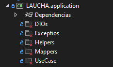

## APPLICATION (aplicacion)

La capa de aplicacion es la capa que envuelve al nucleo y probablemente se trate de la capa en donde se encuentra la mayor parte del codigo. Es en esta capa en la que se implementan los casos de uso del sistema. Aqui los desarrolladores deben implementar las features definidas con anterioridad.

En LAUCHA esta capa se implementa como un proyecto utilizando el template de biblioteca de clases de .NET 6,debido a que este proyecto debe envolver al proyecto de dominio, el proyecto de application posee una referencia de proyecto a domain.

###### captura del proyecto de aplicacion

### DTOs:

En esta carpeta se deben de colocar las clases que representen a los DTO (Data Transfer Objecto), estos objetos permiten que la informacion viaje entre capas evitando exponer las entidades fuera de la capa de dominio es por ello que la capa de aplicacion NUNCA deberia de interacturar con las clases definidas en el dominio sino que en su lugar deberia de trabajar con DTOs.

Los DTOs se codifican como clases POCO y pueden contener informacion proveniente de varios fuentes o tablas de la base de datos y concentrarlas en una unica clase simple.Por ejemplo podemos tener un objeto llamado CustomerDTO que represente a un cliente el cual posee informacion proveniente de dos tablas de la base de datos.Puede ver este ejemplo con mayor profundidad en el siguiente [link](https://www.oscarblancarteblog.com/2018/11/30/data-transfer-object-dto-patron-diseno/)

