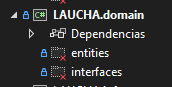

## DOMAIN (dominio)

El dominio es la capa mas interna del software y funciona como el nucleo de la aplicacion , en esta capa se deben definir y modelar las entidades del negocio.
Por ejemplo los empleados , las liquidaciones , los creditos son algunos ejemplos de entidades.


En LAUCHA esta capa se implementa como un proyecto utilizando el template de biblioteca de clases de .NET 6, debido a que el dominio es el nucleo de la aplicacion este proyecto no hace referencia a nigun otro proyecto.
este proyecto posee dos carpetas:


###### captura del proyecto de dominio

### Entities:

En este carpeta se crean las clases que representan las entidades , estas clases deben ser del tipo POCO , es decir, deben poseer unicamente atributos por ende carecen de metodos. Por ejemplo una clase Empleado podria modelarse de la siguiente forma:

```
// Esta clase es una clase POCO.
public class Empleado
{
    public int Dni { get; set; }
    public string Nombre { get; set; }
    public string Apellido { get; set; }
    public DateTime FechaNacimiento { get; set; }
}
```

### Interfaces

En esta carpeta se crean los "contratos" ,es decir, las abstraccions que deberan implermentar las otras capas para llevar a cabo la logica de negocio.Nos referimos a que esta carpeta se componen de archivos que unicamente con interfaces a implementar.Cada archivo debe poseer unicamente una interface y el nombre del mismo debe iniciar con "I"

Por ejemplo una interface que define un repositorio para crear y eliminar un empleado. La interface debera ser implementada por alguna clase en el futuro.

``````
// Una interface de un repositorio
public interface IEmpleadoRepository
{
    Empleado crearEmpleado(Empleado nuevoEmpleado);
    Empleado EliminarEmpleado(int DniEmp);
}
``````
